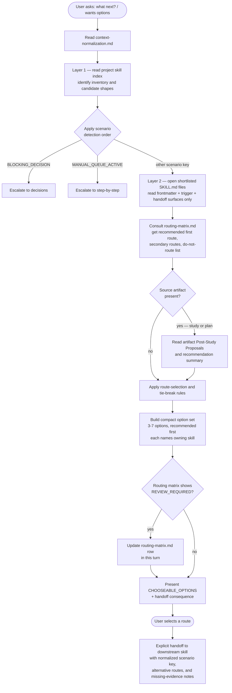

# chooseable-options
A lightweight next-step router that normalizes the current conversation state, consults a reviewed routing matrix, and presents a compact menu of 3-7 chooseable options — one recommended first. It does not execute the chosen route itself; it explicitly hands off to the owning downstream skill with a normalized scenario summary.

## Install

The fastest cross-agent install path is the `skills` CLI:

```bash
npx skills add gg-skills/chooseable-options
```

Drop this skill into a workspace as a Git submodule for pinned versions, or as a plain clone for latest `main`:

```bash
# Project-local, version-pinned:
git submodule add git@github.com:gg-skills/chooseable-options.git .claude/skills/chooseable-options

# OR project-local, latest main:
mkdir -p .claude/skills
git -C .claude/skills clone git@github.com:gg-skills/chooseable-options.git

# OR user-level, available in every project on this machine:
mkdir -p ~/.claude/skills
git -C ~/.claude/skills clone git@github.com:gg-skills/chooseable-options.git
```

Restart your agent or reload skills after installation. See the parent [`skills` catalog repo](https://github.com/gg-skills/skills) for the full catalog.

## When to use

- The user explicitly asks "what should I do next?", "give me options", or "what are the next logical steps?"
- A study, plan, spec, audit, or session-analysis artifact exists and several plausible next actions compete for attention.
- The user wants a compact routing menu before entering a planning, decisions, step-by-step, study, research, or skill-authoring workflow.
- A skill-authoring or governance task needs a context-aware menu of likely next actions.

**Skip when:**
- A deeper workflow is already explicitly chosen and should run directly.
- The current state is a single blocker choice that belongs in `decisions`.
- The work is already an ordered manual queue that belongs in `step-by-step`.

## How it operates

### Inputs

| Source | What is read |
|--------|-------------|
| Conversation context | Current user request, visible artifacts, prior turn summaries |
| Project skill index | Generated index published by the project-local skill manager — used for inventory awareness (Layer 1) |
| `references/context-normalization.md` | Scenario detection order, route-selection rules, tie-break logic, escalation thresholds |
| `references/routing-matrix.md` | Reviewed routing lanes, recommended first routes, secondary routes, do-not-route rules, expert capability bridges |
| Shortlisted `SKILL.md` files | Opened on demand (Layer 2) for the 1-4 candidate skills that survived the inventory shortlist — frontmatter `description`, `AUTO_TRIGGER_WHEN`, `AUTO_SUGGEST_WHEN`, `Cross-Skill Coordination`, `HANDOFF_OUTPUTS`, and closeout sections only |
| Source artifact (if present) | Path, recommendation summary, and `Post-Study Proposals` when the source is a completed study |

**Environment variables:** none required.

### Outputs

The skill produces only conversational output — no files are written.

| Section | Content |
|---------|---------|
| `Current scenario` | Normalized scenario key (e.g. `EXECUTION_ARTIFACT_READY`) plus a one-sentence description |
| `Why these are the next logical steps` | Short paragraph explaining why the recommended option is ranked first |
| `CHOOSEABLE_OPTIONS` | Flat bulleted list, recommended option first, each naming the owning downstream skill or workflow. 3-7 options maximum on the first pass. |
| `What happens after selection` | Explicit description of the handoff consequence so the user knows what will happen when they choose |

Option token family names vary by scenario: `CHOOSEABLE_OPTIONS`, `IMPLEMENTATION_OPTIONS`, `CONTROL_OPTIONS`, `GOVERNANCE_OPTIONS`, `SPECIALIST_OPTIONS`, `RESEARCH_OPTIONS`.

### External commands

None. This skill makes no CLI, MCP, or API calls. All routing logic is inference over read files.

### Side effects

| Category | Detail |
|----------|--------|
| File mutations | None under normal operation |
| Routing matrix update | If the matrix shows `REVIEW_REQUIRED` for a skill used this turn, the skill updates `references/routing-matrix.md` in the same turn before closing — this is the only write side effect |
| Git / network | No git commits or network requests |
| Downstream skill invocation | Not automatic — the skill hands off explicitly; the user must choose a route |

### Mode toggles

| Toggle | Behavior |
|--------|----------|
| Default | 3-7 options, one recommended first, explicit handoff |
| Escalation (automatic) | If the option space is blocker-rich, hands off to `decisions`; if evidence is insufficient, escalates to `study`; if a manual queue is active, escalates to `step-by-step` |
| Dry run | Not applicable — no mutations occur by default |

## Operational flow



## Layout

```
chooseable-options/
├── README.md
├── SKILL.md
├── agents/
│   └── openai.yaml
├── assets/
│   ├── icon-large.png
│   ├── icon-large.svg
│   ├── icon-master.png
│   └── icon-small.svg
└── references/
    ├── context-normalization.md
    └── routing-matrix.md
```

## Quick start

1. Install the skill (see [Install](#install) above).
2. In any Claude Code session where you have a study, plan, or open-ended situation, invoke the skill:
   - `What should I do next?`
   - `Give me chooseable options for where to go from here.`
   - `I finished the study — what are my next steps?`
3. Review the `CHOOSEABLE_OPTIONS` menu and pick a route.
4. The skill hands off to the downstream owning skill with a normalized scenario summary.

## Resources

- `references/context-normalization.md` — scenario detection order, evidence inputs, escalation rules, route-selection and tie-break logic, output assembly rules.
- `references/routing-matrix.md` — reviewed scenario routing lanes, in-batch workflow skill rows, expert capability bridges, pending review queue.
- [gg-skills](https://github.com/gg-skills/skills) — parent repo with all skills in the unprefixed skills namespace.

## Caveats

- **Router only, not executor.** This skill presents options and hands off. It does not run the chosen workflow itself.
- **Two-layer model is mandatory.** The skill reads the project skill index first (Layer 1) and opens individual `SKILL.md` files only for shortlisted candidates (Layer 2). Reading the entire skill corpus defeats the lightweight-routing purpose.
- **3-7 option hard limit on the first pass.** If more options seem relevant, group them by token family (e.g. `IMPLEMENTATION_OPTIONS` vs. `RESEARCH_OPTIONS`) and surface only the top option from each group.
- **Study closeout proposals take precedence.** When the source is a completed study, its own `Post-Study Proposals` are inspected before general routing matrix logic overrides the recommendation.
- **Routing matrix is the truth layer.** Routes must come from `references/routing-matrix.md`. The skill does not improvise routes from memory or invent new ones when the matrix does not cover a scenario — it escalates instead.
- **Snapshot age.** The routing matrix was last fully reviewed on `2026-05-03`. Verify release-sensitive routing against the current skill index if significant time has passed.
